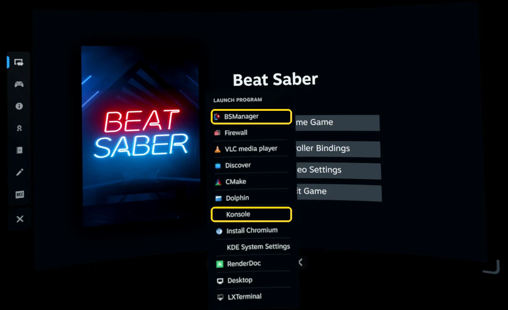
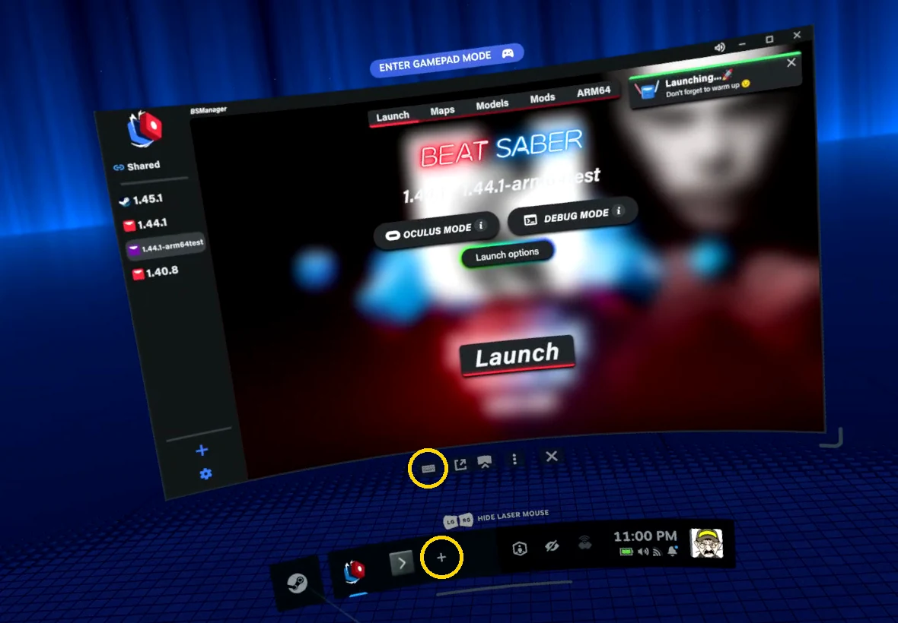
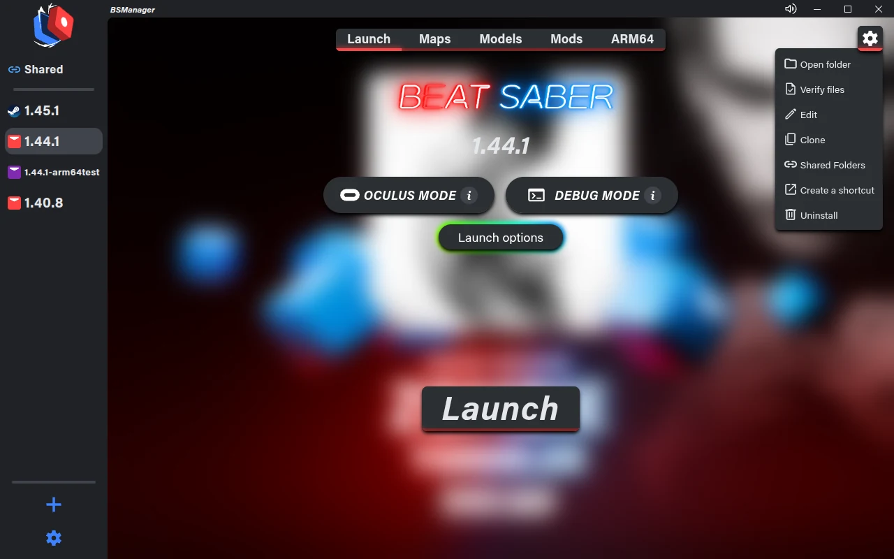
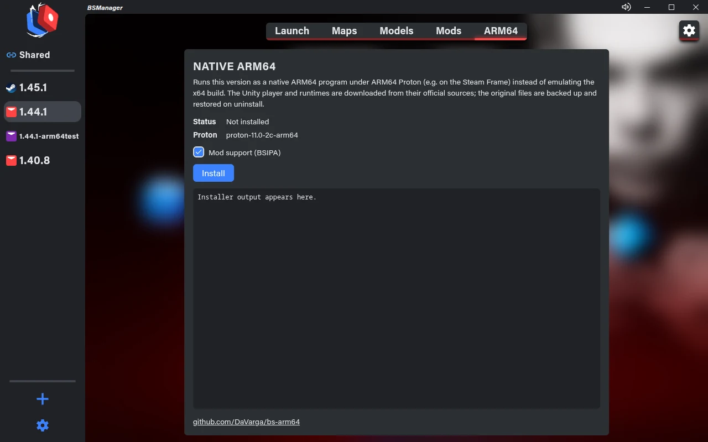
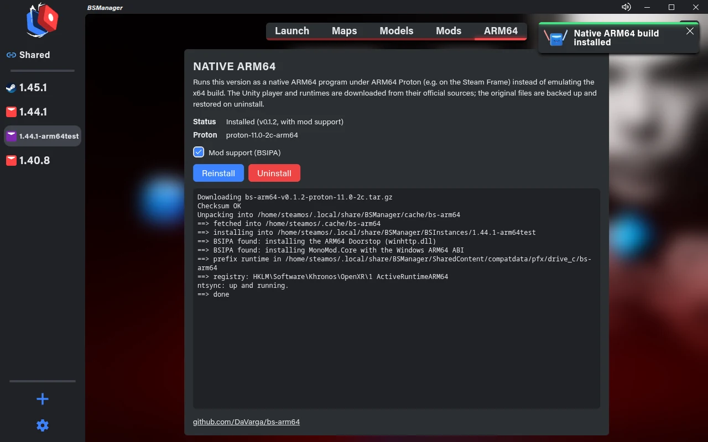

# How to install BSManager on the Steam Frame

This fork runs on the Steam Frame (ARM64 SteamOS). Installing it takes one command:

```sh
curl -fsSL https://github.com/DaVarga/bs-manager/releases/latest/download/install.sh | bash
```

It installs BSManager to `~/Applications/BSManager.AppImage`, adds it to the app menu (a `.desktop`
entry with icon), and lets BeatSaver's **OneClick** buttons open it. BSManager then updates itself.

There are two ways to run the command. On the Frame itself you type with the on-screen keyboard.
From a PC over SSH you can use a real keyboard, or just paste.

## Before you start

- Beat Saber in your Steam library.
- **Proton 11.0 (ARM64)** installed. Steam installs it the first time you start a Windows game;
  otherwise install it from the library (Tools).

## Option A: on the Frame, with the on-screen keyboard

1. In VR, open the dashboard and click **+** in the bar at the bottom. A **Launch program** list
   opens. Choose **Konsole** (the terminal).

   

2. Click the **keyboard icon** under the Konsole window to open the on-screen keyboard.
3. Type the command above exactly and press Enter. Watch out for:
   - `-fsSL`: capital `S` and `L`
   - `|`: the pipe character before `bash`
   - no spaces inside the address

   If the command is open in a browser on the Frame, copy it there and use Konsole's **Paste**
   button (top right) instead of typing it.
4. When it prints `done`, close Konsole. **BSManager** is now in the same **Launch program** list.

   

## Option B: from your PC over SSH

Set this up once on the Frame:

1. **Settings → System → Enable Developer Mode.**
2. In Konsole, give the `steamos` user a password (SteamOS has none by default):
   ```sh
   passwd
   ```
3. Turn on the SSH server:
   ```sh
   sudo systemctl enable --now sshd
   ```
4. Find the Frame's IP address, for example `192.168.1.56` (use the `wlan0` line):
   ```sh
   ip -4 -brief addr
   ```

Then on your PC, open **PowerShell** (Windows 10/11 ships `ssh`) or a terminal (Linux, macOS) and
connect:

```sh
ssh steamos@192.168.1.56
```

Answer `yes` to the fingerprint question the first time, enter the password, and paste the install
command.

Anyone on your network who knows the password can log in while SSH is on. To turn it off again:

```sh
sudo systemctl disable --now sshd
```

## Native ARM64 Beat Saber

BSManager runs the x64 version of Beat Saber through emulation. For **1.44.1** it can install a
native ARM64 build instead, which needs less than half the CPU time per frame:

1. Download or select Beat Saber **1.44.1** in BSManager. To keep the x64 version too, work on a
   copy: gear menu at the top right → **Clone**.

   

2. Open the **ARM64** tab next to Mods and click **Install**. Keep **Mod support (BSIPA)** checked to
   use mods.

   

3. When the log ends with `done`, the version is native. Launch it as usual. **Reinstall** after a
   Proton update, and **Uninstall** puts the x64 files back.

   

Details: [bs-arm64](https://github.com/DaVarga/bs-arm64).

## Update or remove

- **Update:** BSManager offers updates itself. Running the install command again also updates.
- **Remove:**
  ```sh
  curl -fsSL https://github.com/DaVarga/bs-manager/releases/latest/download/install.sh | bash -s -- --uninstall
  ```
  Your versions, maps and settings in `~/.local/share/BSManager` stay.
